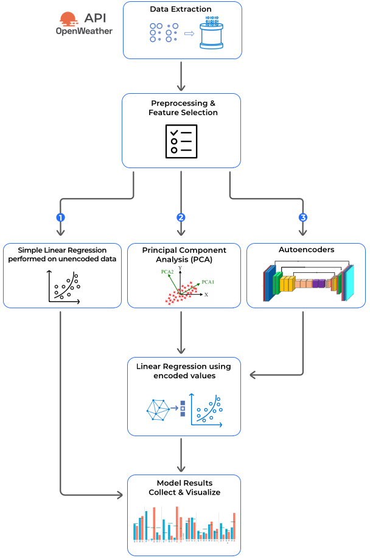
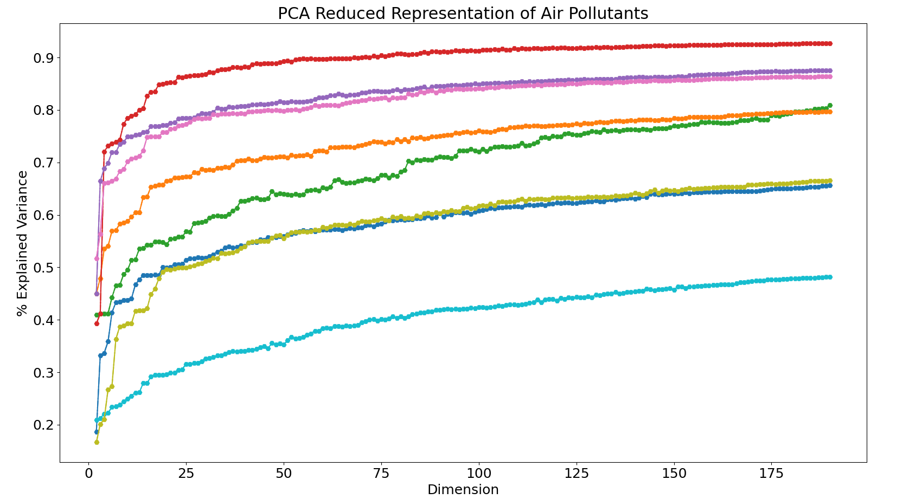
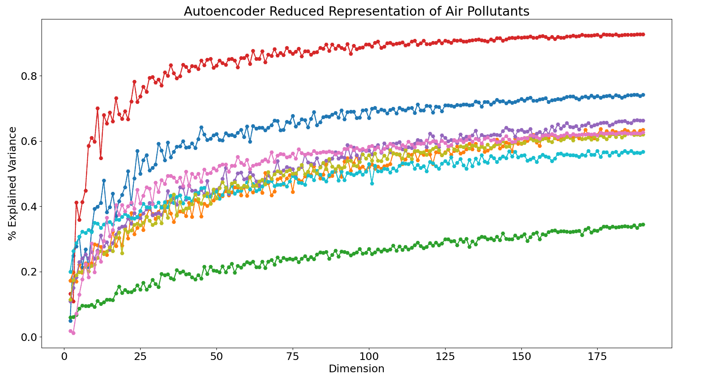
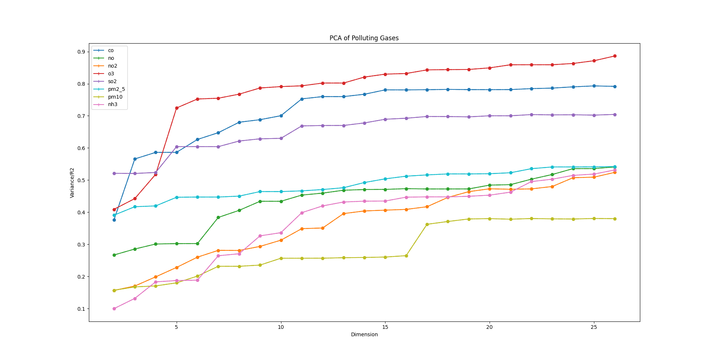
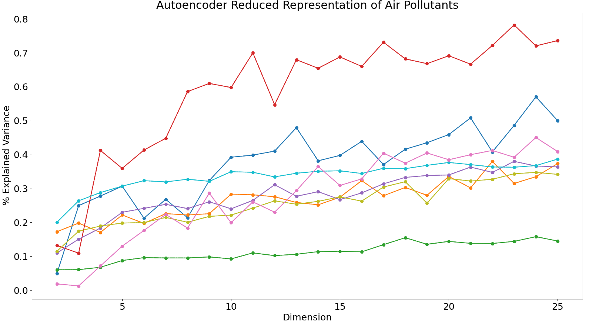
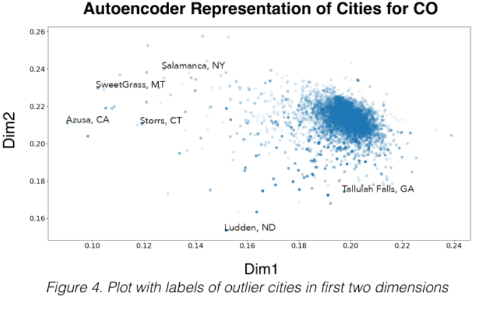

# Pollution-Autoencoders

## Overview

**Pollution Autoencoders** uses a deep autoencoder neural network to characterize cities in the United States based on time-series readings of various polluting gases and particulates. We compared the [Autoencoders](https://www.deeplearningbook.org/contents/autoencoders.html) method with [Principle Component Analysis (PCA)](https://www.sartorius.com/en/knowledge/science-snippets/what-is-principal-component-analysis-pca-and-how-it-is-used-507186), an older technique for reducing the dimensionality of a data set. 

  </td></td>

The main advantage of Autoencoders have over PCA is in their capability of discovering non-linear relationships between polluting gases. Autoencoders are able to capture more of the explained variance because of this increased flexibility.

We measured the explained variance across 190 dimensions for each of the 8 polluting gases by performing a simple linear regression on the compressed data generated by both the PCA and Autoencoder methods. As a control, we also performed linear regression on the uncompressed data.

## Setup Guide 

Clone the repository to the desired location.
<pre><code>git clone https://github.com/nshan651/Pollution-Autoencoders.git</code></pre>
Install the required packages.
<pre><code>pip install pandas numpy matplotlib sklearn tensorflow requests</code></pre>

## A Brief Introduction to Autoencoders

An autoencoder is a neural network that encodes its input data into a low-dimensional latent space encoding. Once the input is encoded, it can be decoded by reconstructing the input using the latent space.

  

Autoencoders are usually restricted in ways that allow them to copy approximately. which forces the model to prioritize which elements of the input should be copied. In the process of imperfectly copying the input, we hope that the latent dimensions will take on useful properties. Such a method of constraining the hidden layer to have smaller dimensions than the input is referred to as an **Undercomplete Autoencoder**.

For example, a particularly interesting usecase for us was in clustering cities based on the first two dimensions. The first two dimensions of both models were especially useful because they happened to result in some of the largest jumps in explained variance.[[1]](#1)

## Methodology

The main use of an undercomplete autoencoder is not in its ability to perfectly reconstruct the input, but in the useful features it is capable of distilling. 

In our case, we wanted to see what properties the autoencoder model could extract when given time series air pollution data for various cities throughout the United States. Using data from [OpenWeather's Air Pollution API](https://openweathermap.org/api/air-pollution), we constructed data frames for eight polluting gases and particulates. We obtained the daily averages of each pollutant six and a half months for just over eighteen-thousand cities in the U.S. and other U.S. territories. 

  
  <i style="font-size: 8pt">Carbon Monoxide Data</i>

After obtaining the requisite data, we cleaned and preprocessed the data by removing cities that had the same name and any entries with missing values. While this made the data quickly useable, a more ideal solution would be to add a state/country code to distinguish between cities and to impute any missing values. For more on this see the [future improvements](#future-improvements) section.

We compared the autoencoder model to Principle Component Analysis, a much older technique used for dimensionality reduction that has been a part of statistical literature since the early twentieth century.[[2]](#2) The main distinction between autoencoders and PCA is that autoencoders can span a nonlinear subspace, whereas PCA learns the principle subspace.

Autoencoders that employ nonlinar encoder and decoder functions can create a more powerful generalization than PCA. However, an autoencoder model that is allowed too much capacity is at risk of reconstructing the input "too perfectly" without extracting any useful information.[[3]](#1)

## Pipeline

  

1. We used the final column of the time series data as the dependent variable to be predicted in the regressions.

2. For PCA, we performed K-folds cross-validation with 5 folds. The data was split into a training, validation, and final test set. We reduced the dimensions from 191 to 2 dimensions.

3. The autoencoder model consists of a single densely encoded and decoded layer. Both layers used tanh as an activation function.

## Results

We compared the results from Principal Component Analysis (PCA) and the Autoencoder models across 190 dimensions.

<table align=center><tr>
<td>  </td>
<td>  </td>
</tr></table>

Unfortunately did not have the time to properly tune the autoencoder [(in progress!)](#future-improvements) so gains in explained variance were mixed. However, one thing we noticed was that their was a large jump in explained variance for the first few dimensions in both types of models. Graphing the first 25 dimensions makes this more clear.

<table align=center><tr>
<td>  </td>
<td>  </td>
</tr></table>

One of the benefits of dimensionality reduction is that it can make visualization easier. We created a clustering of different cities for Carbon Monoxide in the first two dimensions in order to see how the model characterized different cities. We plotted some of the outliers against a list of very populous cities.

  

It came as little surprise that the most prominent characterization the model made was in highly populated versus less populated cities. We are still searching for more nuanced characteristics that could be interesting.

## Future Improvements

## References

<a id="1">[1,3]</a> 
Ian Goodfellow, Yoshua Bengio, Aaron Courville (2016). 
Deep Learning. MIT Press.

<a id="2">[2]</a> 
Jolliffe, I.T. (2002). 
Principle Component Analysis -- 2nd ed. 
Library of Congress Cataloging-in-Publication Data.

